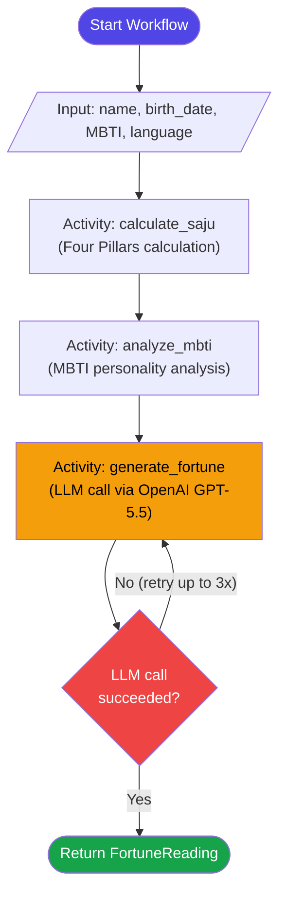
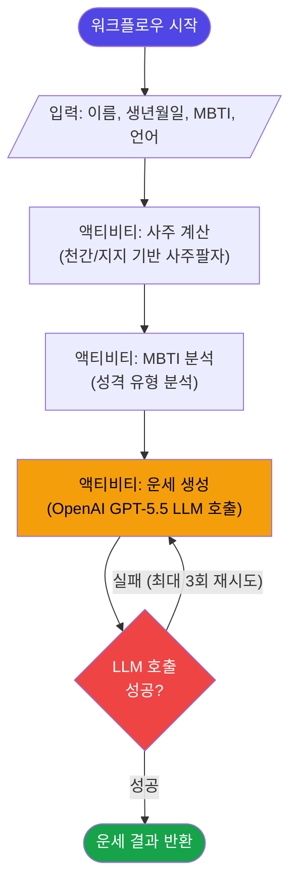
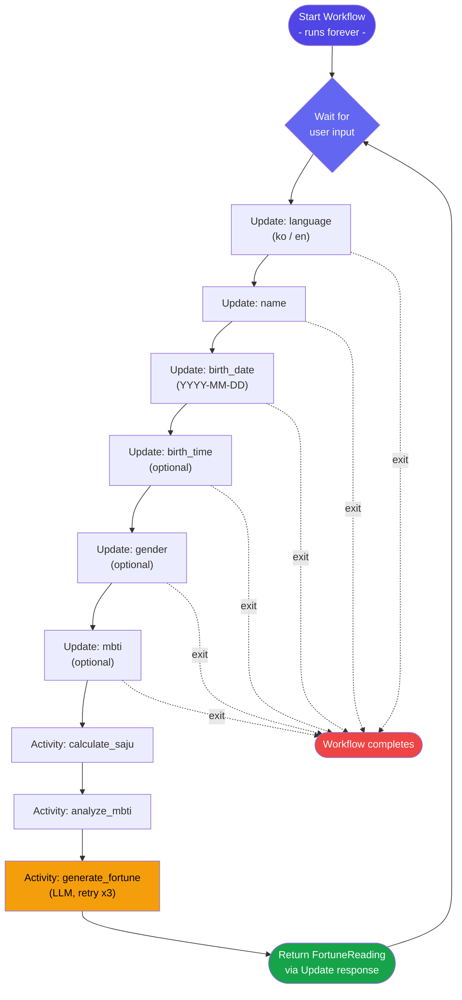
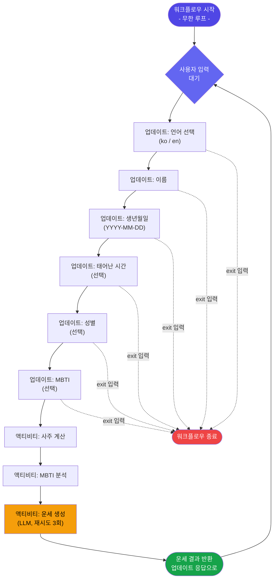

# Workflow Diagrams / 워크플로우 다이어그램

## FortuneWorkflow (One-shot Fortune Reading / 일회성 운세)

### English

### 한국어

---

## InteractiveFortuneWorkflow (Interactive Booth / 대화형 운세 부스)

### English

### 한국어

---

## Temporal Features Highlighted / 활용된 Temporal 기능

| Feature | FortuneWorkflow | InteractiveFortuneWorkflow |
|---|---|---|
| `@workflow.run` | One-shot execution | Infinite loop |
| `@workflow.update` | - | Step-by-step input (request-response) |
| `@workflow.query` | `status`, `result` | `current_prompt`, `session_number` |
| `@workflow.signal` | - | `shutdown` |
| `RetryPolicy` | LLM activity (3x) | LLM activity (3x) |
| `workflow.upsert_memo` | - | Records each step's input |
| Durable execution | Survives worker restart | Survives disconnect + reconnect |
