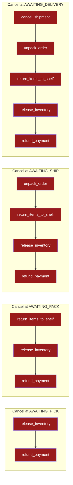
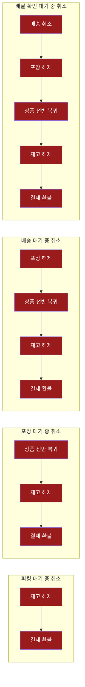
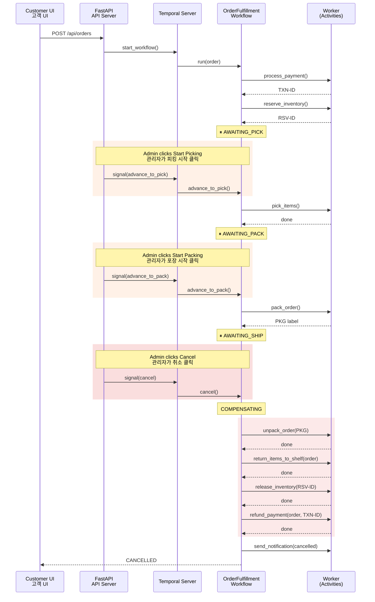

```mermaid
flowchart TD
    A([Order Received]) --> P["Activity: process_payment<br/>(auto-retry x3)"]
    P --> PF{Payment<br/>succeeded?}
    PF -- "No (retry)" --> P
    PF -- Yes --> PC[Payment Confirmed]

    PC --> HV{Order ><br/>₩1,000,000?}
    HV -- No --> INV
    HV -- Yes --> AWAIT_APPROVE["AWAITING_APPROVAL<br/>⏸ Wait for admin signal"]
    AWAIT_APPROVE --> AP{Signal<br/>received?}
    AP -- "approve" --> INV
    AP -- "cancel" --> COMP
    AP -- "timeout 5 min" --> COMP

    INV["Activity: reserve_inventory"] --> AWAIT_PICK["AWAITING_PICK<br/>⏸ Wait for admin"]
    AWAIT_PICK --> PICK_SIG{Signal?}
    PICK_SIG -- "advance_to_pick" --> PICK["Activity: pick_items"]
    PICK_SIG -- "cancel" --> COMP

    PICK --> AWAIT_PACK["AWAITING_PACK<br/>⏸ Wait for admin"]
    AWAIT_PACK --> PACK_SIG{Signal?}
    PACK_SIG -- "advance_to_pack" --> PACK["Activity: pack_order"]
    PACK_SIG -- "cancel" --> COMP

    PACK --> AWAIT_SHIP["AWAITING_SHIP<br/>⏸ Wait for admin"]
    AWAIT_SHIP --> SHIP_SIG{Signal?}
    SHIP_SIG -- "advance_to_ship" --> SHIP["Activity: arrange_shipment"]
    SHIP_SIG -- "cancel" --> COMP

    SHIP --> NOTIFY["Activity: send_notification<br/>(shipped!)"]
    NOTIFY --> AWAIT_DEL["AWAITING_DELIVERY<br/>⏸ Wait for admin"]
    AWAIT_DEL --> DEL_SIG{Signal?}
    DEL_SIG -- "confirm_delivery" --> DEL([DELIVERED])
    DEL_SIG -- "cancel" --> COMP

    COMP["SAGA COMPENSATION<br/>(reverse order)"]
    COMP --> C1["cancel_shipment<br/>(if shipped)"]
    C1 --> C2["unpack_order<br/>(if packed)"]
    C2 --> C3["return_items_to_shelf<br/>(if picked)"]
    C3 --> C4["release_inventory<br/>(if reserved)"]
    C4 --> C5["refund_payment<br/>(if charged)"]
    C5 --> CANCELLED([CANCELLED])

    style A fill:#4F46E5,color:#fff
    style DEL fill:#16A34A,color:#fff
    style CANCELLED fill:#EF4444,color:#fff
    style AWAIT_APPROVE fill:#F59E0B,color:#000
    style AWAIT_PICK fill:#F97316,color:#fff
    style AWAIT_PACK fill:#F97316,color:#fff
    style AWAIT_SHIP fill:#F97316,color:#fff
    style AWAIT_DEL fill:#F97316,color:#fff
    style COMP fill:#DC2626,color:#fff
    style C1 fill:#991B1B,color:#fff
    style C2 fill:#991B1B,color:#fff
    style C3 fill:#991B1B,color:#fff
    style C4 fill:#991B1B,color:#fff
    style C5 fill:#991B1B,color:#fff
```

```mermaid
flowchart TD
    A([주문 접수]) --> P["액티비티: 결제 처리<br/>(자동 재시도 3회)"]
    P --> PF{결제<br/>성공?}
    PF -- "실패 재시도" --> P
    PF -- 성공 --> PC[결제 확인]

    PC --> HV{주문 금액 ><br/>₩1,000,000?}
    HV -- 아니오 --> INV
    HV -- 예 --> AWAIT_APPROVE["승인 대기<br/>⏸ 관리자 시그널 대기"]
    AWAIT_APPROVE --> AP{시그널<br/>수신?}
    AP -- "승인" --> INV
    AP -- "취소" --> COMP
    AP -- "시간 초과 5분" --> COMP

    INV["액티비티: 재고 예약"] --> AWAIT_PICK["피킹 대기<br/>⏸ 관리자 시그널 대기"]
    AWAIT_PICK --> PICK_SIG{시그널?}
    PICK_SIG -- "피킹 시작" --> PICK["액티비티: 상품 피킹"]
    PICK_SIG -- "취소" --> COMP

    PICK --> AWAIT_PACK["포장 대기<br/>⏸ 관리자 시그널 대기"]
    AWAIT_PACK --> PACK_SIG{시그널?}
    PACK_SIG -- "포장 시작" --> PACK["액티비티: 주문 포장"]
    PACK_SIG -- "취소" --> COMP

    PACK --> AWAIT_SHIP["배송 대기<br/>⏸ 관리자 시그널 대기"]
    AWAIT_SHIP --> SHIP_SIG{시그널?}
    SHIP_SIG -- "배송 시작" --> SHIP["액티비티: 배송 수배"]
    SHIP_SIG -- "취소" --> COMP

    SHIP --> NOTIFY["액티비티: 알림 발송<br/>(배송 시작!)"]
    NOTIFY --> AWAIT_DEL["배달 확인 대기<br/>⏸ 관리자 시그널 대기"]
    AWAIT_DEL --> DEL_SIG{시그널?}
    DEL_SIG -- "배달 확인" --> DEL([배달 완료])
    DEL_SIG -- "취소" --> COMP

    COMP["사가 보상 처리<br/>(역순 실행)"]
    COMP --> C1["배송 취소<br/>(배송된 경우)"]
    C1 --> C2["포장 해제<br/>(포장된 경우)"]
    C2 --> C3["상품 선반 복귀<br/>(피킹된 경우)"]
    C3 --> C4["재고 해제<br/>(예약된 경우)"]
    C4 --> C5["결제 환불<br/>(결제된 경우)"]
    C5 --> CANCELLED([주문 취소])

    style A fill:#4F46E5,color:#fff
    style DEL fill:#16A34A,color:#fff
    style CANCELLED fill:#EF4444,color:#fff
    style AWAIT_APPROVE fill:#F59E0B,color:#000
    style AWAIT_PICK fill:#F97316,color:#fff
    style AWAIT_PACK fill:#F97316,color:#fff
    style AWAIT_SHIP fill:#F97316,color:#fff
    style AWAIT_DEL fill:#F97316,color:#fff
    style COMP fill:#DC2626,color:#fff
    style C1 fill:#991B1B,color:#fff
    style C2 fill:#991B1B,color:#fff
    style C3 fill:#991B1B,color:#fff
    style C4 fill:#991B1B,color:#fff
    style C5 fill:#991B1B,color:#fff
```

# Workflow Diagrams / 워크플로우 다이어그램

## OrderFulfillmentWorkflow (Order Pipeline / 주문 처리 파이프라인)

### English

### 한국어

---

## Saga Compensation Detail / 사가 보상 상세

Cancellation at any step triggers compensation for **only the steps already completed**:

### English

### 한국어

---

## Temporal Features Highlighted / 활용된 Temporal 기능

| Feature / 기능 | Usage / 사용 |
|---|---|
| `@workflow.signal` | 6 signals: `approve`, `cancel`, `advance_to_pick`, `advance_to_pack`, `advance_to_ship`, `confirm_delivery` |
| `@workflow.query` | `get_status` — real-time order state for UI / 실시간 주문 상태 조회 |
| `workflow.wait_condition` | Durable pause at each step until admin acts / 각 단계에서 관리자 행동까지 내구적 대기 |
| `RetryPolicy` | Payment retries (3x, exponential backoff) / 결제 재시도 (3회, 지수 백오프) |
| Saga compensation | 5 compensation activities, only runs completed steps / 5개 보상 액티비티, 완료된 단계만 실행 |
| Activities | 12 activities across 4 modules / 4개 모듈, 12개 액티비티 |

---

## Signal Flow (Admin UI) / 시그널 흐름 (관리자 UI)

